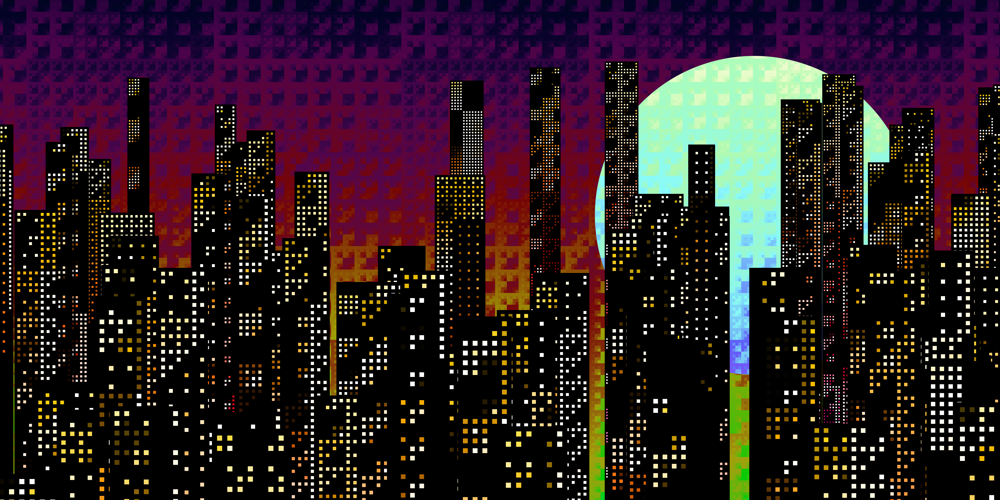
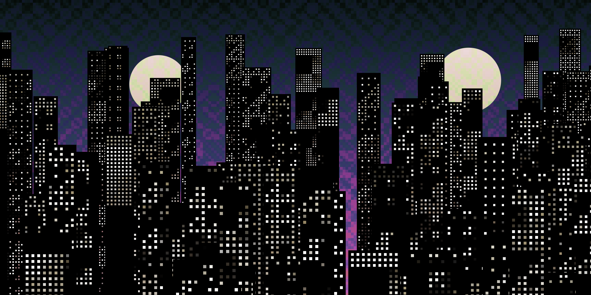

# Bit Dot Night

## Generative Pixel Cityscape

**Bit Dot Night** is a unique generative art piece that creates an infinite, animated cityscape using **bitwise operations** and a seeded pseudo-random number generator. It combines a retro, pixel-art aesthetic with complex mathematical logic to create a diverse array of digital metropolises.

| Trait | Example Values |
| :--- | :--- |
| **Window Operator** | XOR, AND, OR, Addition, Multiplication |
| **Background Operator**| XOR, AND, OR, Division/Reciprocal |
| **Palette** | Grayscale, Rainbow, Shifted Hue |
| **Atmospherics** | Earthquake, Inverted Colors, Thin Buildings, Many Moons |

---

## Image Gallery

### Generated Output

My Best One

### Traits Showcase

<table width="100%">
  <tr>
    <td align="center">
      
       
      <b>Grayscale Palette</b>
    </td>
  </tr>
</table>

---

## The Logic and Math Explained

The core of "Bit Dot Night" lies in its use of a **seeded random number generator** and custom **bitwise arithmetic** to create highly structured yet non-repeating patterns.

### 1. Seeding and Reproducibility

The project uses an FxHash-compatible seeding mechanism (`fxhash`, `b58dec`, `sfc32` functions) to ensure that every generated artwork is **unique and reproducible**.

* **`fxrand()`:** A custom pseudo-random number generator (PRNG) is initialized with the seed.
* **`random` Class:** A wrapper class uses the seed to provide consistent random values (integers, floats, booleans) for setting the initial parameters (e.g., number of moons, color palette, operator types).

### 2. The Operators (Bitwise Math)

The visual structure of the sky and the window patterns of the buildings are determined by a randomized mathematical operation applied to the pixel coordinates.

The static method `ArtGenerator.applyOperator(operator, x, y, seedX, seedY)` takes the coordinates (`x`, `y`) and offsets them by two randomized seeds (`seedX`, `seedY`). The resulting values (`X` and `Y`) are then combined using one of seven functions:

| Operator ID | Function | Explanation |
| :---: | :--- | :--- |
| **0** | `X & Y` | **Bitwise AND:** Results in a pattern that emphasizes overlapping binary structures. |
| **1** | `X | Y` | **Bitwise OR:** Creates a denser, more connected pattern. |
| **2** | `X ^ Y` | **Bitwise XOR:** Creates a repeating, checkerboard-like structure, ideal for abstract window patterns. |
| **3** | `X + Y` | **Addition:** A simple arithmetic operator creating linear gradients. |
| **4** | `X * Y` | **Multiplication:** Creates rapid-changing patterns based on the product of coordinates. |
| **5** | `X/Y + Y/X`| **Division/Reciprocal:** Introduces complex, concentric shapes. |
| **6** | `(X - Y) ^ (X + Y)` | **Complex Bitwise:** A combination of arithmetic and bitwise operations for chaotic results. |

The result of this operation is fed into a cosine function (`Math.cos(o * seedScale)`) to generate a smooth, wave-like **brightness** value, which determines the final color.

### 3. Infinite Generation

The cityscape is animated using an `update()` loop (`requestAnimationFrame`). Instead of drawing the entire scene repeatedly, the logic focuses on drawing **one building** at a time, ensuring a constant, fresh generation of new elements rising from the bottom of the canvas.

* The vertical position (`Y`) of each building is calculated based on the animation **time** (`t`) and a randomized **rooms per second** parameter, giving the illusion of continuous upward movement.

---

## Implementation Details

### File Structure

* `index.html`: The main page structure, loading dependencies (Tailwind, Font Awesome).
* `style.css`: Custom CSS for layout, dark theme, button styling, and **pixel-perfect rendering** (`image-rendering: pixelated;`).
* `script.js`: The core generative logic, seeding, parameters, and drawing functions.

### Canvas Usage

1.  **Offscreen Canvas (High-Res):** A `4096 x 2048` canvas is used for all drawing operations (`this.offscreenCanvas`). This ensures that the generated image, when downloaded, is a high-resolution version, regardless of the user's screen size.
2.  **Main Canvas (Display):** The visible canvas (`#pixelArtCanvas`) scales the high-resolution image down to fit the screen.
